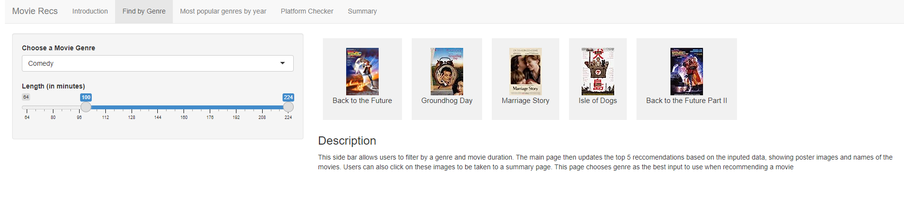

# Movie Recommendation System

## Demo
See the project here: https://allen2yu.shinyapps.io/MovieRecs/ 

## Domain of Interest
> Why are you interested in this field/domain?

Recommendation systems are a relatively new occurrence that have become a necessity when using modern day media platforms. One of the most famous examples of this is movie recommendations, present on a variety of video streaming services such as Netflix, Hulu and HBO. As students interested in data science and the applications thereof, as well as being avid consumers of movies ourselves, we would like to see how we could develop our own movie recommendation program.

>What other examples of data driven projects have you found related to this domain (share at least 3)?

1. [Project 1](https://natassha.github.io/movie_project/). This is a movie recommendation project. The creator compiled movie data from different places and created a big movie dataset. In this project, it recommends five other similar movies when users click on a certain movie. Users can also find movies’ information, such as rating and revenue on this platform.

2. [Project 2](https://www.kaggle.com/rounakbanik/movie-recommender-systems). This was part of a Capstone Project on Movie Data Analysis and Recommendation Systems. In this part of the project, the student implemented recommendation algorithms including content based, popularity based and collaborative filtering. He used two movie-lens datasets, creating a simple recommender system for the larger one, and a more personalized algorithm for the smaller datasets.

3. [Project 3](https://www.kaggle.com/laowingkin/netflix-movie-recommendation#Data-manipulation). This project attempted to create a recommendation mechanism within Netflix using Pearson's r correlation. It used a dataset directly from Netflix, consisting of over 17k movies and 500k customers. The objective was to recommend the best TV shows to users based on self and others' behavior. The data files included: Movie ID (as first line of each new movie record / file), Customer ID, Rating (1 to 5), and Date they gave the ratings.

>What data-driven questions do you hope to answer about this domain (share at least 3)?

1. What user inputs can we use to best recommend a movie?
- There are so many movies now that we think it is better to specify the genre when recommending movies to users. 
We use movie genre as our user input so that users can find the type of movie they want by a simple click. 
2. How would a recommendation system have changed over time?
- The number of genres have increased in the modern era, and some movies are in multiple genres. Therefore, we think it is important to have genres indicator in movie recommendation.
3. What platform is a certain movie on?
-  Other than providing basic information of the movie for users, we also provide what streaming platforms a certain movie is on. We analyze the information of streaming platforms using the IMDb dataset. 
The reason why we provide information about streaming platforms is because this allows users to know where to watch the movie. 

## Finding Data

### Data 1
>Where did you download the data (e.g., a web URL)?

[Data hosted by Ruchi Bhatia](https://www.kaggle.com/ruchi798/movies-on-netflix-prime-video-hulu-and-disney)

>How was the data collected or generated? Make sure to explain who collected the data (not necessarily the same people that host the data), and who or what the data is about?

This dataset is a collection scraped from the Internet Movie Database (IMDb). It contains movie titles, year of production, overview, IMDb/rotten tomatoes ratings, and availability on various streaming services.

>How many observations (rows) are in your data?

There are 16,744 rows.

>How many features (columns) are in the data?

There are 17 columns.

>What questions (from above) can be answered using the data in this dataset?

We are able to find which streaming platform (e.g. Netflix, Prime Video, Disney+) a movie can be found in, and compare this to a target age demographic. This could help influence the recommendation formula in addition to larger factors like ratings and genre. Additionally this contains rotten tomatoes ratings, which can be averaged against or combined with the IMDb data.

## Data 2
>Where did you download the data (e.g., a web URL)?

[Data hosted by Stefano Leone](https://www.kaggle.com/stefanoleone992/imdb-extensive-dataset)

>How was the data collected or generated? Make sure to explain who collected the data (not necessarily the same people that host the data), and who or what the data is about?

The data was scraped from a popular movie dataset called IMDb. It consists of movie names, their ratings and background information.

>How many observations (rows) are in your data?

There are 85,855 rows.

>How many features (columns) are in the data?

There are two CSV files we are interested in, “IMDb movies.csv” (22 columns) and “IMDb ratings.csv” (49 columns). This sums up to a total of 71 columns to work with.

>What questions (from above) can be answered using the data in this dataset?

With this dataset, we can use the ratings to see the popularity of each movie and also the other column factors to influence whatever recommendation formula we end up using. Additionally joining this movies dataset with streaming services could show us the availability of movies on different platforms.

## Data 3
>Where did you download the data (e.g., a web URL)?

[Data hosted by Harshit Shankhdhar](https://www.kaggle.com/harshitshankhdhar/imdb-dataset-of-top-1000-movies-and-tv-shows)

>How was the data collected or generated? Make sure to explain who collected the data (not necessarily the same people that host the data), and who or what the data is about?

The data was found from the IMDb database. It consists of movie titles, release dates, genres, ratings, and background information.

>How many observations (rows) are in your data?

There are 1,000 rows.

>How many features (columns) are in the data?

There are 16 columns.

>What questions (from above) can be answered using the data in this dataset?

This dataset contains IMDb ratings, meta-scores, genres, runtimes, and directors. All of these factors could be very influential in a recommendation formula. Primarily, by knowing the genre and rating, we can create averages to find which genres are more popular. We can also use this to group movies within their respective director, which could provide an interesting tiebreaker or additional influence to the recommendations.
